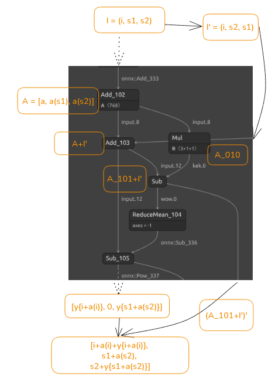

# Is This A Flag?

- [description](#description)
- [solution](#solution)
- [looking around](#looking-around)
- [reversing the backdoor](#reversing-the-backdoor)
    - [what are the outputs?](#what-are-the-outputs)
    - [what happens to inputs?](#what-happens-to-inputs)
    - [what happens in between?](#what-happens-in-between)
    - [piecing everyhting together](#piecing-everyhting-together)

## description


We are given a website and some code. The code turns out to be the implementation of the given website.

The flag should have format `aictf{...}`.

## solution

The website contains fields where we can paste 5 images and then it will tell us what is on these images. We are given 4 example images and 1 image with the ending parenthesis in the format of the flag, like this:


and


The second image is classified as `AICTF flag part 4` (looks reasonable, as it's just how the flag is supposed to end), and the first image isn't classified as something interesting. So we probably need to find such images that will turn out to be classified as parts of AICTF flag.  
The meme with the noise in the description probably hints that there will be no need to construct adversarial images (since we need to get a human-readable image).

The solution goes as follows:

- we will look at how the backdoor is created
- then we will understand that We need to get a certain output in the end of the neural network
- finally, we'll see how to get from the output we need to the input, which will be the answer

### looking at the code

Looking at the code we find that the backend is pretty simple. It loads a certain model, it backdoors it and then it uses a pipeline to classify images.


The `download_model` function simply downloads an image classifier [hf](https://huggingface.co/google/vit-base-patch16-224), [arxiv](https://arxiv.org/abs/2010.11929), which splits an image in patches, and then uses these patches as "tokens" to apply attention and mlp similar how transformers in NLP work. What relevant for us is that it's simply an image classifier.


The backdoor function does two things.  
First it applies the binary patch to the downloaded model.  
Second, it adds additional labels for the parts of the flag.


NB: so, what does `backdoor` mean in this context? It means that:

- given picture of a cat, both the backdoor model and the original model will give us the same output
- given a particular image the output of two models will be drastically different


**To sum up**, we understand that there is some change to the original model, which leads to the model sometimes giving a label `AICTF flag part i`. And we probably need to create such images which will have these labels. So, we will have to look deeper inside the backdoored model.

### reversing the backdoor

We backdoor the model using functions from the given code and then look inside it using [netron](https://github.com/lutzroeder/netron). As far as I know there isn't a simple way to convert a model in onnx format to good torch code (at least what I tried didn't achieve such `decompilation` out of the box).


What we see inside is a computational graph, which looks like this, for example:


in the edges we have data, in the vertices we have operations, which are applied to given data. So, we can understand that the flow from `Add_103` (output of which we denoted as $x$) to `Add_114` in the picture above is actually depicting a normalization layer in transforer, $x\to \frac{x-E(x)}{\sqrt{\mathrm{Var}(x)+\epsilon}}\gamma+\beta$. Indeed, first, in `Sub_105` we subtract from the value of $x$ its mean, $x\to y = x-E(x)$. Then in `div_112` we divide $y$ by the variance, $\sqrt{E(y^2)+\epsilon} = \sqrt{\mathrm{Var}(x)+\epsilon}$. Finally, we multiply it by another constant $\gamma$ in `Mul_113` and add another constant $\beta$ in `Add_114` and obtain $x\to \frac{x-E(x)}{\sqrt{\mathrm{Var}(x)+\epsilon}}\gamma+\beta$. While each operation is relatively simple, we need to repeat them a lot of times to understand the whole neural net which looks like this:


NB: To reduce complexity, it may be useful to understand just modifications from backdoor. It is possible if we just enumerate all the nodes in the original model, and all the nodes and edges in the backdoor model, and then find those nodes which are different from the backdoor model. We will get output like

```text
Nodes unique to Model 2:
  - Gather(wow.5, twist) -> blah.5
  - Sub(mystery, flag.2) -> flag.2.diff
  - Gather(wow.4, twist) -> blah.4
  - Gather(wow.10, twist) -> blah.10
  - Mul(input.208, oio) -> kek.10
  - Gemm(onnx::Gemm_1782, classifier.weight, classifier.bias) -> pre_logits_3
  - Add(cheburek.9, blah.9) -> input.200
  - Concat(orig_conv_out, silly_conv_out_0, silly_conv_out_1) -> onnx::Shape_201
  - Gather(wow.7, twist) -> blah.7
  - Sub(input.92, kek.4) -> wow.4
  ...
```

which is helpful, but we'll go through just by observing the differences in the graph.

#### what are the outputs?

We'll start from the output, because the classes must be modified from only 1000 (in original model) to 1000 + 5 (flag parts) in backdoored.


And we indeed see that there are pre_logits and fake_logits concatted into whole logits. On the left (leading to pre_logits) is a part from the original model and on the right (leading to fake_logits) is the part from the backdoored model.  
We see that in the `Where` node the outputs from the previous computation $y_i$ is checked to be near zero, and if so, the logit corresponding to that part of the flag is assigned to a very big number (i.e. its probability will be 1); otherwise logits are set to -inf (with probabilities going to zero).  


We see that $y_i = E(|\mathrm{mystery-flag.i}|)$, where $\mathrm{flag.i}$ is stored inside the model (and can be extracted). And the mystery data is simply the first and second part of the tensor `input.240`, i.e. `input.240[1,2]`. The zeroth part of `input.240` is used to create the original logits (which, by comparison to original model, seem to be the same so they may not modified at all).


The step function (arising in `where` comparison) makes it impossible to create an adversarial example by gradient descent, starting from the probabilities of the flag parts (since this gradient will be 0 almost everywhere).

To extract flag parts (and other tensors) we can use somrthing like

```python
def get_flag_values(model_for_extraction, name):
    ans = {node.output[0]: node.attribute for node in model_for_extraction.graph.node if any([name in i for i in node.output]) and node.op_type == 'Constant'}
    return onnx.numpy_helper.to_array(ans[name][0].t)
flag_names = [f"flag.{i}" for i in range(5)]
flag_data = {k: get_flag_values(model_for_extraction, k) for k in flag_names}
```

**To sum up**, we now know that to solve the problem we need our `mystery` output to equal the `flag.i` tensors which we can extract from the model.

#### what happens to inputs?

So what are these `input.240[1,2]`? Let's go to the very beginning:


We see that the exists an eyelike tensor (`EyeLike`) which is convolved with the pixel values (`SillyConv_0`, `SillyConv_1`) and then concatted to the original inputs (`Conv_0`) like different images from a batch; `SillyConv_0` and `SillyConv_1` are exactly the parts which which later turn into mystery.

What happens to them is in fact a very simple thing.

[EyeLike](https://onnx.ai/onnx/operators/onnx__EyeLike.html) is simply a tensor with ones on its diagonal and zeros everywhere else.

And these convolutions, are in fact, just matrix multiplications applied to the patches of 16x16, since they have `stride = 16`, `kernel = (16,16)` and `c_in=3` and `c_out = 768`, so that `c_out = kernel_1*kernel_2*c_in`. To be absolutely clear, the eyelike convolutions simply take each pixel unmodified from each 16x16 patch (on the pic the take pixel and its color is highlighted for each of the 768 parts of the resulting embedding of the patch):


There is some more transformation going on a bit further, like addition of positional embeddings, we will talk about it later.

**To sum up**, we now know the `mystery` output is the transformation of just the raw pixels of the image.

#### what happens in between?

The problem is that to go from the end to the beginning in transformer is not simple. You cannot just invert its operations. Think of it like repeatedly solving $x^{2344923}+a_{2344922}*x^{2344922}+a_{2344921}*x^{2344921}+\ldots = b$: you might indeed find all the $2344923$ roots of such a polynomial (good luck with numerical instabilities though), but which one did you want to find? And there are even more problems which are connected with the fact that there are `mean` and `softmax` caclulations in several places which can give the same answer for different inputs.

But let's look inside one of the 12 encoder layers. Maybe the backdoor actually helps us with that.

The encoder layer looks like this:


We will denote the output of MLP and normalization as an application of $y$ function and the output of the attention + normalization layer as application of $a$ function (their are both not exactly linear).

So if we denote the input tensor as $I = [i, s_1, s_2]$ and carefully write what happens to it at each stage, we get the following picture:



- First of all, it is transformed by attention into $A = [a, a(s_1), a(s_2)]$. 
- But then it is also twisted into $I' = [i, s_2, s_1]$ (`lol.0`)
- `Add_103` creates `A+I'` (`input.12`)
- Multiplication takes `A` and multiplies it by `ioi=[[[0],[1],[0]]]`, creating $A_{010} = [0, a(s_1), 0]$ (`kek.0`)
- Then substraction takes `input.12` and `kek.0` and creates `I'+A_101`, $A_{101} = [a, 0, a(s_2)]$ (`wow.0`)
- Output of `Sub_105` (which is `A+I' = (i+a, s2+a(s1), s1+a(s2))` minus some mean) travels through the MLP layer and gets multiplied by `ioi`, creating $[y(i+a(i)), 0, y(s1+a(s2))]$ (`cheburek.0`).
- `wow.0` also gets twisted and gives $(A_{101}+I')' = [i+a, s1+a(s2), s2]$ (`blah.0`) 
- finally, `cheburek.0` and `blah.0` get appended at `Add_127` and create $o = [i+a(i)+y(i+a(i)), s_1+a(s_2), s_2+y(s_1+a(s_2))]$

It's now clear that this layer does nothing to the original logits, $i \to i+a(i)+y(i+a(i))$, as it should in transformer.

But it does a very funny thing to the additional two inputs: $s_1 \to s_1' \equiv s_1+a(s_2)$ and $s_2 \to s_2' \equiv s_2+y(s_1+a(s_2)) = s_2+y(s_1')$. From the second equation, we see that $\boxed{s_2 = s_2' - y(s_1')}$ and from the first $\boxed{s_1 = s_1' - a(s_2)}$. This means that we can get from primed variables to original variables and invert the part of transformer we are interested in.

**To sum up**, we now know how to transform the `mystery` output to the raw pixels of the image and get the flag! Everything that's left is just writing the right code for it.

#### piecing everyhting together

Now we just look how the original model layers [were named](https://github.com/huggingface/transformers/blob/main/src/transformers/models/vit/modeling_vit.py) in torch


write reversal using our formulae


(don't forget to check that $s_1\approx s_2$, as it should be)  
and don't forget to substract positional embeddigns and do some reshape bs which accounts for the pixel reordering by fake convolutions in the beginning:


or, looking at the whole pictures:


Addition was indeed all we needed here :)

---

UPD: the accompanying dirty notebook can be found [here](https://colab.research.google.com/drive/1AnAJzTLzxNlP4Lcst6zPHzyT9hQM2FpV?usp=sharing); I do not plan to clean it up, but better with dirty code than without any. You need to put the example images and backdoor file to the corresponding folders by using google drive or uploading manually.
